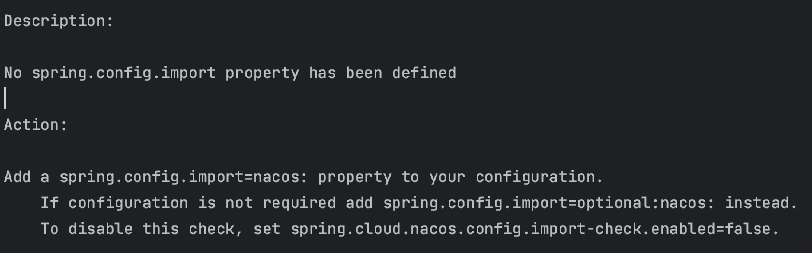

# docker安装必备软件

mac 拉取镜像时需要配置
```bash
--platform linux/amd64
```

不然会报错
```bash
no matching manifest for linux/arm64/v8 in the manifest list entries
```

## PostgreSql

```bash
docker pull postgres
docker run --name postgres -e POSTGRES_PASSWORD=postgres -d -p 5432:5432 postgres

# 在/var/lib/postgresql/data/pg_hba.conf中
# 将 host all all all scram-sha-256
# 改为 host all all all trust
```

## nacos

```bash
docker pull- -platform amd64 nacos/nacos-server
docker run --name nacos -d -p 8848:8848 -p 9848:9848 -p 9849:9849 -e MODE=standalone nacos/nacos-server:v2.2.3-slim

# login http://localhost:8848/nacos
```


