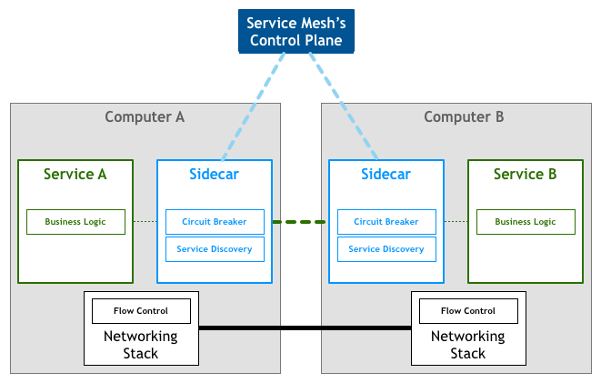
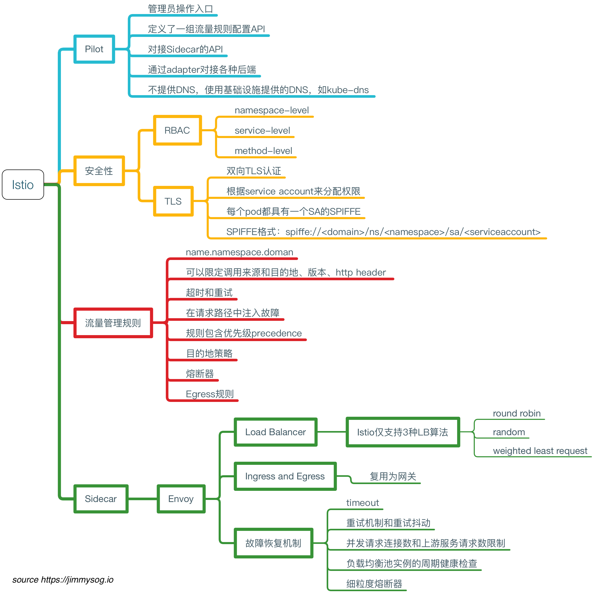
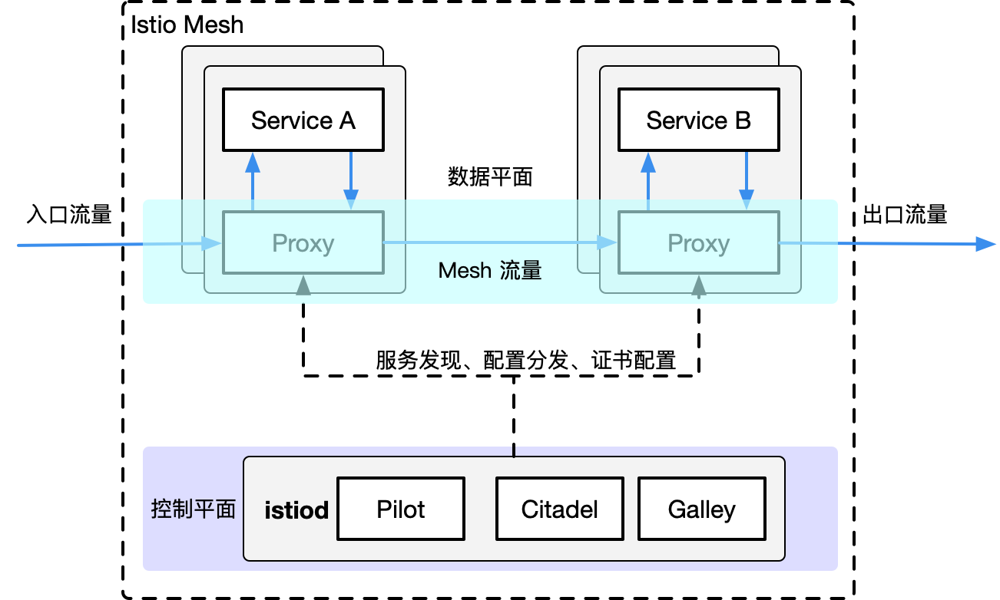
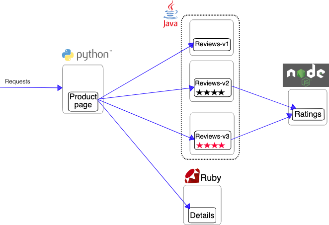
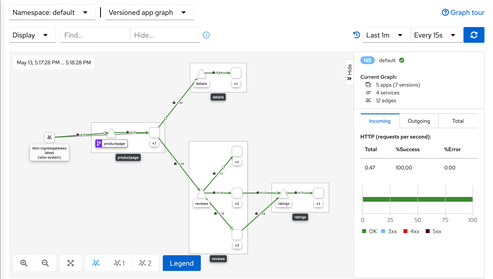
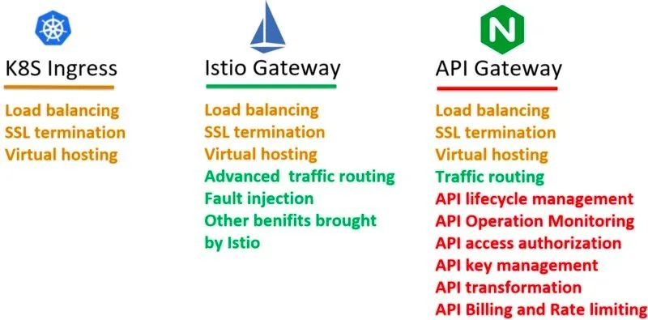
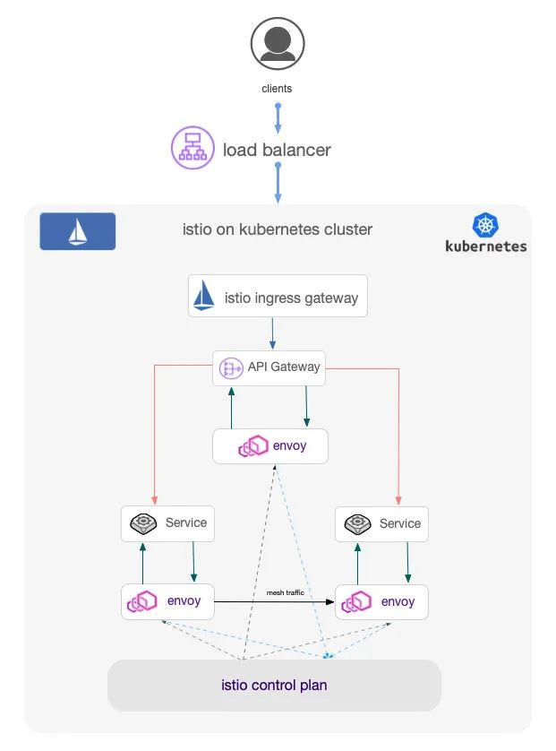

# 一、Istio简介
Istio 是一个开源服务网格，它透明地分层到现有的分布式应用程序上。Istio 解决了开发人员和运营商在分布式微服务架构中面临的挑战。
## 1.1 什么是服务网格(Service Mesh)
Service Mesh 又译作 “服务网格”，作为服务间通信的基础设施层。
英文原文如下：
A Service Meshis a dedicated infrastructure layer for handling service-to-service communication. It’s responsible for the reliable delivery of requests through the complex topology of services that comprise a modern, cloud native application. In practice, the Service Mesh is typically implemented as an array of lightweight network proxies that are deployed alongside application code, without the application needing to be aware.
中文版：
服务网格（Service Mesh）是处理服务间通信的基础设施层。它负责构成现代云原生应用程序的复杂服务拓扑来可靠地交付请求。在实践中，Service Mesh 通常以轻量级网络代理阵列的形式实现，这些代理与应用程序代码部署在一起，对应用程序来说无需感知代理的存在。
### 1.1.1 服务网格特点
服务网格有如下几个特点：

- 应用程序间通讯的中间层
- 轻量级网络代理
- 应用程序无感知
- 解耦应用程序的重试/超时、监控、追踪和服务发现
### 1.1.2 服务网格工作流程
")

1. 控制平面将整个网格中的服务配置推送到所有节点的 [**sidecar**](https://jimmysong.io/kubernetes-handbook/GLOSSARY.html#sidecar) 代理中。
2. [**Sidecar**](https://jimmysong.io/kubernetes-handbook/GLOSSARY.html#sidecar) 代理将服务请求路由到目的地址，根据中的参数判断是到生产环境、测试环境还是 staging 环境中的服务（服务可能同时部署在这三个环境中），是路由到本地环境还是公有云环境？所有的这些路由信息可以动态配置，可以是全局配置也可以为某些服务单独配置。
3. 当 [**sidecar**](https://jimmysong.io/kubernetes-handbook/GLOSSARY.html#sidecar) 确认了目的地址后，将流量发送到相应服务发现端点，在 Kubernetes 中是 service，然后 service 会将服务转发给后端的实例。
4. [**Sidecar**](https://jimmysong.io/kubernetes-handbook/GLOSSARY.html#sidecar) 根据它观测到最近请求的延迟时间，选择出所有应用程序的实例中响应最快的实例。
5. [**Sidecar**](https://jimmysong.io/kubernetes-handbook/GLOSSARY.html#sidecar) 将请求发送给该实例，同时记录响应类型和延迟数据。
6. 如果该实例挂了、不响应了或者进程不工作了，[**sidecar**](https://jimmysong.io/kubernetes-handbook/GLOSSARY.html#sidecar) 将把请求发送到其他实例上重试。
7. 如果该实例持续返回 error，[**sidecar**](https://jimmysong.io/kubernetes-handbook/GLOSSARY.html#sidecar) 会将该实例从负载均衡池中移除，稍后再周期性得重试。
8. 如果请求的截止时间已过，[**sidecar**](https://jimmysong.io/kubernetes-handbook/GLOSSARY.html#sidecar) 主动失败该请求，而不是再次尝试添加负载。
9. [**Sidecar**](https://jimmysong.io/kubernetes-handbook/GLOSSARY.html#sidecar) 以 metric 和分布式追踪的形式捕获上述行为的各个方面，这些追踪信息将发送到集中 metric 系统。
## 1.2 Istio架构
	
### 1.2.1 特性
使用istio的进行微服务管理有如下特性：

- **流量管理**：控制服务间的流量和API调用流，使调用更可靠，增强不同环境下的网络鲁棒性。
- **可观测性**：了解服务之间的依赖关系和它们之间的性质和流量，提供快速识别定位问题的能力。
- **策略实施**：通过配置mesh而不是以改变代码的方式来控制服务之间的访问策略。
- **服务识别和安全**：提供在mesh里的服务可识别性和安全性保护。
### 1.2.2 架构
Istio 服务网格从逻辑上分为数据平面和控制平面。

- **数据平面**由一组智能代理（[Envoy](https://www.envoyproxy.io/)）组成，被部署为 [sidecar](https://jimmysong.io/kubernetes-handbook/GLOSSARY.html#sidecar)。
   - 由一组智能代理（Envoy）以 [sidecar](https://jimmysong.io/kubernetes-handbook/GLOSSARY.html#sidecar) 模式部署，协调和控制所有服务之间的网络通信。
- **控制平面**管理并配置代理来进行流量路由。
   - 负责管理和配置代理路由流量，以及在运行时执行的政策。

下图展示了组成每个平面的不同组件：
[](https://jimmysong.io/kubernetes-handbook/images/istio-mesh-arch.png)
### 1.2.3 Istio组件
#### Envoy
Istio 使用 Envoy 代理的扩展版本，该代理是以 C++ 开发的高性能代理，用于调解服务网格中所有服务的所有入站和出站流量。
Envoy 代理被部署为服务的 [sidecar](https://jimmysong.io/kubernetes-handbook/GLOSSARY.html#sidecar)，在逻辑上为服务增加了 Envoy 的许多内置特性，例如:

- 动态服务发现
- 负载均衡
- TLS 终端
- HTTP/2 与 gRPC 代理
- 熔断器
- 健康检查
- 基于百分比流量分割的分阶段发布
- 故障注入
- 丰富的指标

Envoy 在 Pod 中以 [sidecar](https://jimmysong.io/kubernetes-handbook/GLOSSARY.html#sidecar) 模式部署。 这允许 Istio 将大量关于流量行为的信号作为属性提取出来，并发送给监控系统以提供有关整个服务网格的行为信息。[Sidecar](https://jimmysong.io/kubernetes-handbook/GLOSSARY.html#sidecar) 代理模型还允许你将 Istio 功能添加到现有部署中，无需重新构建或重写代码。
#### Pilot
Pilot 为 Envoy [sidecar](https://jimmysong.io/kubernetes-handbook/GLOSSARY.html#sidecar) 提供服务发现、用于智能路由的流量管理功能（例如，A/B 测试、金丝雀发布等）以及弹性功能（超时、重试、熔断器等）。
#### Citadel
Citadel 通过内置的身份和证书管理，可以支持强大的服务间以及最终用户的身份验证。
#### Galley
Galley 是 Istio 的配置验证、提取、处理和分发组件。它负责将其余的 Istio 组件与从底层平台（例如 Kubernetes）获取用户配置的细节隔离开来。
# 二、Istio快速入门
完成下面步骤需要您有一个 cluster， 且运行着兼容版本的 Kubernetes (1.24, 1.25, 1.26, 1.27)。 您可以使用任何支持的平台，例如： [Minikube](https://kubernetes.io/zh-cn/docs/tasks/tools/#minikube) 或[特定平台安装说明](https://istio.io/latest/zh/docs/setup/platform-setup/)章节中指定的其他平台。
## 2.1 下载 Istio

1. 转到 [Istio 发布](https://github.com/istio/istio/releases/tag/1.18.2) 页面，下载针对您操作系统的安装文件
2. 转到 Istio 包目录。例如，如果包是 istio-1.18.2：
```shell
cd istio-1.18.2
```

   1. 安装目录包含：
      - samples/ 目录下的示例应用程序
      - bin/ 目录下的 [**istioctl**](https://istio.io/latest/zh/docs/reference/commands/istioctl) 客户端二进制文件。
3. 将 istioctl 客户端添加到路径（Linux 或 macOS）：
```shell
export PATH=$PWD/bin:$PATH
```
## 2.2 安装 Istio

1. 对于本次安装，我们采用 demo [配置组合](https://istio.io/latest/zh/docs/setup/additional-setup/config-profiles/)。 选择它是因为它	包含了一组专为测试准备的功能集合，另外还有用于生产或性能测试的配置组合。如果您的平台有供应商提供的配置组合，比如 Openshift，则在下面命令中替换掉 demo 配置项。更多细节请参阅[平台说明](https://istio.io/latest/zh/docs/setup/platform-setup/)。
```shell
istioctl install --set profile=demo -y

✔ Istio core installed
✔ Istiod installed
✔ Egress gateways installed
✔ Ingress gateways installed
✔ Installation complete
```

2. 给命名空间添加标签，指示 Istio 在部署应用的时候，自动注入 Envoy 边车代理：
```shell
kubectl label namespace default istio-injection=enabled

namespace/default labeled
```
## 2.3 部署示例应用
部署Istio官方Demo进行快速入门。这个应用模仿在线书店的一个分类，显示一本书的信息。 页面上会显示一本书的描述，书籍的细节（ISBN、页数等），以及关于这本书的一些评论。
Bookinfo 应用分为四个单独的微服务：

- productpage：这个微服务会调用 details 和 reviews 两个微服务，用来生成页面。
- details：这个微服务中包含了书籍的信息。
- reviews：这个微服务中包含了书籍相关的评论。它还会调用 ratings 微服务。
- ratings：这个微服务中包含了由书籍评价组成的评级信息。

reviews 微服务有 3 个版本：

- v1 版本不会调用 ratings 服务。
- v2 版本会调用 ratings 服务，并使用 1 到 5 个黑色星形图标来显示评分信息。
- v3 版本会调用 ratings 服务，并使用 1 到 5 个红色星形图标来显示评分信息。



1. 部署 [Bookinfo示例应用](https://istio.io/latest/zh/docs/examples/bookinfo/)：
```shell
kubectl apply -f samples/bookinfo/platform/kube/bookinfo.yaml

service/details created
serviceaccount/bookinfo-details created
deployment.apps/details-v1 created
service/ratings created
serviceaccount/bookinfo-ratings created
deployment.apps/ratings-v1 created
service/reviews created
serviceaccount/bookinfo-reviews created
deployment.apps/reviews-v1 created
deployment.apps/reviews-v2 created
deployment.apps/reviews-v3 created
service/productpage created
serviceaccount/bookinfo-productpage created
deployment.apps/productpage-v1 created
```

2. 应用很快会启动起来。当每个 Pod 准备就绪时，Istio 边车将伴随应用一起部署。
```shell
kubectl get services

NAME          TYPE        CLUSTER-IP      EXTERNAL-IP   PORT(S)    AGE
details       ClusterIP   10.0.0.212      <none>        9080/TCP   29s
kubernetes    ClusterIP   10.0.0.1        <none>        443/TCP    25m
productpage   ClusterIP   10.0.0.57       <none>        9080/TCP   28s
ratings       ClusterIP   10.0.0.33       <none>        9080/TCP   29s
reviews       ClusterIP   10.0.0.28       <none>        9080/TCP   29s
```
和在执行下一步之前，重新运行上面的命令直到所有的 Pod 达到此状态：就绪状态（READY）的值为 2/2、状态（STATUS）的值为 Running。 基于您平台的不同，这个操作过程可能会花费几分钟的时间。

3. 确认上面的操作都正确之后，运行下面命令，通过检查返回的页面标题来验证应用是否已在集群中运行，并已提供网页服务：
```shell
kubectl exec "$(kubectl get pod -l app=ratings -o jsonpath='{.items[0].metadata.name}')" -c ratings -- curl -sS productpage:9080/productpage | grep -o "<title>.*</title>"

<title>Simple Bookstore App</title>
```
## 2.4 对外开放应用程序
此时，BookInfo 应用已经部署，但还不能被外界访问。 要开放访问，您需要创建 [Istio 入站网关（Ingress Gateway）](https://istio.io/latest/zh/docs/concepts/traffic-management/#gateways)， 它会在网格边缘把一个路径映射到路由。

1. 把应用关联到 Istio 网关：
```shell
kubectl apply -f samples/bookinfo/networking/bookinfo-gateway.yaml

gateway.networking.istio.io/bookinfo-gateway created
virtualservice.networking.istio.io/bookinfo created
```

2. 确保配置文件没有问题：
```shell
istioctl analyze

✔ No validation issues found when analyzing namespace: default.
```
### 确定入站 IP 和端口
示例环境为无外部负载均衡的k8s环境,其他环境可参见[官网](https://istio.io/latest/zh/docs/setup/getting-started/#download)
```shell
export INGRESS_PORT=$(kubectl -n istio-system get service istio-ingressgateway -o jsonpath='{.spec.ports[?(@.name=="http2")].nodePort}')
export SECURE_INGRESS_PORT=$(kubectl -n istio-system get service istio-ingressgateway -o jsonpath='{.spec.ports[?(@.name=="https")].nodePort}')
export INGRESS_HOST=$(kubectl get po -l istio=ingressgateway -n istio-system -o jsonpath='{.items[0].status.hostIP}')
```

1. 设置环境变量 GATEWAY_URL：
```
$ export GATEWAY_URL=$INGRESS_HOST:$INGRESS_PORT
```

2. 确保 IP 地址和端口均成功地赋值给了环境变量：
```
$ echo "$GATEWAY_URL"
```
### 验证外部访问
用浏览器查看 Bookinfo 应用的产品页面，验证 Bookinfo 已经实现了外部访问。

1. 运行下面命令，获取 Bookinfo 应用的外部访问地址。
```shell
echo "http://$GATEWAY_URL/productpage"
```

2. 把上面命令的输出地址复制粘贴到浏览器并访问，确认 Bookinfo 应用的产品页面是否可以打开。
## 2.5 查看仪表板
Istio 和[几个](https://istio.io/latest/zh/docs/ops/integrations)遥测应用做了集成。 遥测能帮您了解服务网格的结构、展示网络的拓扑结构、分析网格的健康状态。
使用下面说明部署 [Kiali](https://istio.io/latest/zh/docs/ops/integrations/kiali/) 仪表板、 以及 [Prometheus](https://istio.io/latest/zh/docs/ops/integrations/prometheus/)、 [Grafana](https://istio.io/latest/zh/docs/ops/integrations/grafana)、 还有 [Jaeger](https://istio.io/latest/zh/docs/ops/integrations/jaeger/)。

1. 安装 [Kiali 和其他插件](https://github.com/istio/istio/tree/release-1.18/samples/addons)，等待部署完成。
```shell
kubectl apply -f samples/addons
kubectl rollout status deployment/kiali -n istio-system
```

2. 访问 Kiali 仪表板。
```shell
istioctl dashboard kiali --address 172.19.249.140
```

3. 在左侧的导航菜单，选择 _Graph_ ，然后在 _Namespace_ 下拉列表中，选择 _default_ 。要查看追踪数据，必须向服务发送请求。请求的数量取决于 Istio 的采样率。 采样率在安装 Istio 时设置，默认采样速率为 1%。在第一个跟踪可见之前，您需要发送至少 100 个请求。 使用以下命令向 productpage 服务发送 100 个请求：
```shell
for i in `seq 1 100`; do curl -s -o /dev/null http://$GATEWAY_URL/productpage; done
```
Kiali 仪表板展示了网格的概览以及 Bookinfo 示例应用的各个服务之间的关系。 它还提供过滤器来可视化流量的流动。[](https://istio.io/latest/zh/docs/setup/getting-started/kiali-example2.png)
# 三、体验Istio特性
## 3.1 请求路由
### 3.1.1 路由到特定版本
```yaml
kubectl get virtualservices -o yaml

- apiVersion: networking.istio.io/v1beta1
  kind: VirtualService
  ...
  spec:
    hosts:
    - details
    http:
    - route:
      # 在 destination 字段中制定对应版本
      - destination:
          host: details
          subset: v1
- apiVersion: networking.istio.io/v1beta1
  kind: VirtualService
  ...
  spec:
    hosts:
    - productpage
    http:
    - route:
      - destination:
          host: productpage
          subset: v1
- apiVersion: networking.istio.io/v1beta1
  kind: VirtualService
  ...
  spec:
    hosts:
    - ratings
    http:
    - route:
      - destination:
          host: ratings
          subset: v1
- apiVersion: networking.istio.io/v1beta1
  kind: VirtualService
  ...
  spec:
    hosts:
    - reviews
    http:
    - route:
      - destination:
          host: reviews
          subset: v1
```
### 3.1.12 根据用户进行路由
```yaml
apiVersion: networking.istio.io/v1beta1
kind: VirtualService
...
spec:
  hosts:
  - reviews
  http:
  # 在match字段根据对应规则设置路由,此处设置headers中end-user==jason进入版本v2,其余进入v1
  - match:
    - headers:
        end-user:
          exact: jason
    route:
    - destination:
        host: reviews
        subset: v2
  - route:
    - destination:
        host: reviews
        subset: v1
```
## 3.2 注入 HTTP 延迟故障
为了测试微服务应用程序 Bookinfo 的弹性，我们将为用户 jason 在 reviews:v2 和 ratings 服务之间注入一个 7 秒的延迟。 这个测试将会发现一个故意引入 Bookinfo 应用程序中的 bug。

1. 设置`ratings`7s延迟
```yaml
apiVersion: networking.istio.io/v1beta1
kind: VirtualService
spec:
  hosts:
  - ratings
  http:
  - fault:
      delay:
      # 设置7s延迟
        fixedDelay: 7s
        percentage:
          value: 100
    match:
    - headers:
        end-user:
          exact: jason
    route:
    - destination:
        host: ratings
        subset: v1
  - route:
    - destination:
        host: ratings
        subset: v1
```
Istio可以手动设置延迟,帮助发现由不同的团队独立开发不同的微服务的企业应用程序中的超时异常
## 3.3 流量转移
```yaml

apiVersion: networking.istio.io/v1beta1
kind: VirtualService
...
spec:
  hosts:
  - reviews
  http:
  - route:
    - destination:
        host: reviews
        subset: v1
      weight: 50 # v1设置50%流量
    - destination:
        host: reviews
        subset: v3
      weight: 50 # v3设置50%流量
```
使用 Istio，两个版本的 reviews 服务可以独立地进行扩容和缩容， 而不会影响这两个服务版本之间的流量分发。
# 四、Istio与API网关
### 4.1 无法满足的Api控制需求
采用Gateway和VirtualService实现的Istio Ingress Gateway提供了网络入口处的基础通信功能，包括可靠的通信和灵活的路由规则。但对于一个服务化应用来说，网络入口除了基础的通讯功能之外，还有一些其他的应用层功能需求，例如：

- 第三方系统对API的访问控制
- 用户对系统的访问控制
- 修改请求/返回数据
- 服务API的生命周期管理
- 服务访问的SLA、限流及计费
- ….


### 4.2 Istio与Api网关相结合

- 仍然利用 `istio ingress gateway`作为入口
- 将 `istio ingress gateway`接到 `LB`
- 将`API Gateway`纳入到`istio cluster`管理的范畴当中，即拥有`sidecar proxy`，可被`istio`控制面控制。`API Gateway`的选型很有可能使用云原生应用网关，如 `API SIX`
- 应用层微服务**不会**利用如 spring cloud gateway 编码一个服务网关


# 五、问题
下面的内容引用自陈鹏[在生产环境使用 Istio 前的若干考虑要素](https://cloudnative.to/blog/the-facts-of-using-istio/)，有删改。
## 5.1 使用 Istio 无法做到完全对应用透明
服务通信和治理相关的功能迁移到 [sidecar](https://jimmysong.io/kubernetes-handbook/GLOSSARY.html#sidecar) 进程中后， 应用中的 SDK 通常需要作出一些对应的改变。
比如 SDK 需要关闭一些功能，例如重试。一个典型的场景是，SDK 重试 m 次，[sidecar](https://jimmysong.io/kubernetes-handbook/GLOSSARY.html#sidecar) 重试 n 次，这会导致 m * n 的重试风暴，从而引发风险。
此外，诸如 trace header 的透传，也需要 SDK 进行升级改造。如果你的 SDK 中还有其它特殊逻辑和功能，这些可能都需要小心处理才能和 Isito [sidecar](https://jimmysong.io/kubernetes-handbook/GLOSSARY.html#sidecar) 完美配合。
## 5.2 Istio 对非 Kubernetes 环境的支持有限
在业务迁移至 Istio 的同时，可能并没有同步迁移至 Kubernetes，而还运行在原有 PAAS 系统之上。 这会带来一系列挑战：

- 原有 PaaS 可能没有容器网络，Istio 的服务发现和流量劫持都可能要根据旧有基础设施进行适配才能正常工作；
- 如果旧有的 PAAS 单个实例不能很好的管理多个容器（类比 Kubernetes 的 Pod 和 Container 概念），大量 Istio [sidecar](https://jimmysong.io/kubernetes-handbook/GLOSSARY.html#sidecar) 的部署和运维将是一个很大的挑战；
- 缺少 Kubernetes webhook 机制，[sidecar](https://jimmysong.io/kubernetes-handbook/GLOSSARY.html#sidecar) 的注入也可能变得不那么透明，而需要耦合在业务的部署逻辑中；
## 5.3 只有 HTTP 协议是一等公民
Istio 原生对 HTTP 协议提供了完善的全功能支持，但在真实的业务场景中，私有化协议却非常普遍，而 Istio 却并未提供原生支持。
这导致使用私有协议的一些服务可能只能被迫使用 TCP 协议来进行基本的请求路由，这会导致很多功能的缺失，这其中包括 Istio 非常强大的基于内容的消息路由，如基于 header、 path 等进行权重路由。
## 5.4 扩展 Istio 的成本并不低
虽然 Istio 的总体架构是基于高度可扩展而设计，但由于整个 Istio 系统较为复杂，如果你对 Istio 进行过真实的扩展，就会发现成本不低。
以扩展 Istio 支持某一种私有协议为例，首先你需要在 Istio 的 API 代码库中进行协议扩展，其次你需要修改 Istio 代码库来实现新的协议处理和下发，然后你还需要修改 xds 代码库的协议，最后你还要在 Envoy 中实现相应的 Filter 来完成协议的解析和路由等功能。
在这个过程中，你还可能面临上述数个复杂代码库的编译等工程挑战（如果你的研发环境不能很好的使用 Docker 或者无法访问部分国外网络的情况下）。
即使做完了所有的这些工作，你也可能面临这些工作无法合并回社区的情况，社区对私有协议的扩展支持度不高，这会导致你的代码和社区割裂，为后续的升级更新带来隐患。
## 5.5 Istio 在集群规模较大时的性能问题
Istio 默认的工作模式下，每个 [sidecar](https://jimmysong.io/kubernetes-handbook/GLOSSARY.html#sidecar) 都会收到全集群所有服务的信息。如果你部署过 Istio 官方的 Bookinfo 示例应用，并使用 Envoy 的 config dump 接口进行观察，你会发现，仅仅几个服务，Envoy 所收到的配置信息就有将近 20w 行。
可以想象，在稍大一些的集群规模，Envoy 的内存开销、Istio 的 CPU 开销、XDS 的下发时效性等问题，一定会变得尤为突出。
Istio 这么做一是考虑这样可以开箱即用，用户不用进行过多的配置，另外在一些场景，可能也无法梳理出准确的服务之间的调用关系，因此直接给每个 [sidecar](https://jimmysong.io/kubernetes-handbook/GLOSSARY.html#sidecar) 下发了全量的服务配置，即使这个 [sidecar](https://jimmysong.io/kubernetes-handbook/GLOSSARY.html#sidecar) 只会访问其中很小一部分服务。
当然这个问题也有解法，你可以通过 [sidecar](https://jimmysong.io/kubernetes-handbook/GLOSSARY.html#sidecar) [CRD](https://jimmysong.io/kubernetes-handbook/GLOSSARY.html#crd) 来显示定义服务调用关系，使 Envoy 只得到他需要的服务信息，从而大幅降低 Envoy 的资源开销，但前提是在你的业务线中能梳理出这些调用关系。
## 5.6 XDS 分发没有分级发布机制
当你对一个服务的策略配置进行变更的时候，XDS 不具备分级发布的能力，所有访问这个服务的 Envoy 都会立即收到变更后的最新配置。这在一些对变更敏感的严苛生产环境，可能是有很高风险甚至不被允许的。
如果你的生产环境严格要求任何变更都必须有分级发布流程，那你可能需要考虑自己实现一套这样的机制。
## 5.7 Istio 组件故障时是否有退路？
以 Istio 为代表的 [sidecar](https://jimmysong.io/kubernetes-handbook/GLOSSARY.html#sidecar) 架构的特殊性在于，[sidecar](https://jimmysong.io/kubernetes-handbook/GLOSSARY.html#sidecar) 直接承接了业务流量，而不像一些其他的基础设施那样，只是整个系统的旁路组件（比如 Kubernetes）。
因此在 Isito 落地初期，你必须考虑，如果 [sidecar](https://jimmysong.io/kubernetes-handbook/GLOSSARY.html#sidecar) 进程挂掉，服务怎么办？是否有退路？是否能 fallback 到直连模式？
在 Istio 落地过程中，是否能无损 fallback，通常决定了核心业务能否接入服务网格。
## 5.8 Istio 缺乏成熟的产品生态
Istio 作为一套技术方案，却并不是一套产品方案。如果你在生产环境中使用，你可能还需要解决可视化界面、权限和账号系统对接、结合公司已有技术组件和产品生态等问题，仅仅通过命令行来使用，可能并不能满足你的组织对权限、审计、易用性的要求。
而 Isito 自带的 Kiali 功能还十分简陋，远远没有达到能在生产环境使用的程度，因此你可能需要研发基于 Isito 的上层产品。目前有一些服务网格的商业化公司致力于解决 Istio 的产品生态问题，如 [Tetrate](https://tetrate.io/) 就是在基于 Istio、Envoy 和 Apache SkyWalking 构建企业级服务网格。
## 5.9 Istio 目前解决的问题域还很有限
Istio 目前主要解决的是分布式系统之间服务调用的问题，但还有一些分布式系统的复杂语义和功能并未纳入到 Istio 的 [sidecar](https://jimmysong.io/kubernetes-handbook/GLOSSARY.html#sidecar) 运行时之中，比如消息发布和订阅、状态管理、资源绑定等等。
云原生应用将会朝着多 [sidecar](https://jimmysong.io/kubernetes-handbook/GLOSSARY.html#sidecar) 运行时或将更多分布式能力纳入单 [sidecar](https://jimmysong.io/kubernetes-handbook/GLOSSARY.html#sidecar) 运行时的方向继续发展，以使服务本身变得更为轻量，让应用和基础架构彻底解耦。
如果你的生产环境中，业务系统对接了非常多和复杂的分布式系系统中间件，Istio 目前可能并不能完全解决你的应用的云原生化诉求。

# 参考资料

1. [Istio官网](https://istio.io/latest/zh/)
2. [掘金Istio实战](https://juejin.cn/post/7116400234711744525)
3. [jimmysong.io](https://jimmysong.io/kubernetes-handbook/usecases/before-using-istio.html)
4. [上了 istio 的贼船之 API Gateway](https://developer.aliyun.com/article/893629)
