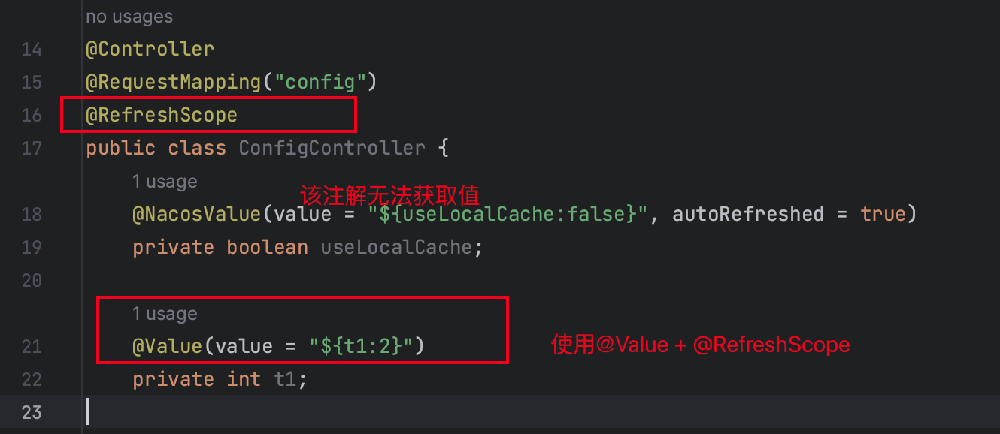
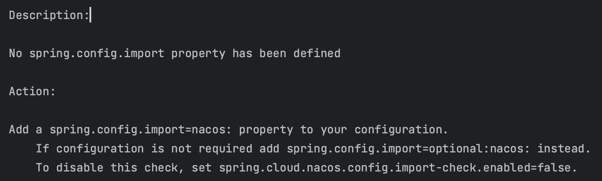

# Nacos

## 参考资料
https://sca.aliyun.com/zh-cn/docs/2022.0.0.0/user-guide/nacos/quick-start/

https://help.aliyun.com/zh/edas/developer-reference/implement-service-registration-and-discovery?spm=a2c4g.11186623.0.0.10de42817ffYL9

## 环境准备

## 问题

1. @NacosValue注解无法获取值
   1. 使用@Value代替@NacosValue, 当要使用动态刷新时,在类上添加@RefreshScope注解
   2. 
2. No spring.config.import property has been defined
